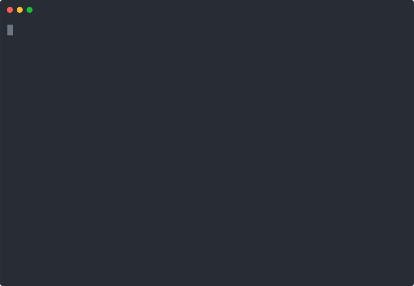

# `aocf` - Advent of Code fetch

[](https://github.com/nuxeh/aocf/actions?query=branch%3Amaster+event%3Apush+workflow%3Abuild)
[](https://github.com/nuxeh/aocf/actions?query=branch%3Amaster+event%3Apush+workflow%3Atests)
[](https://github.com/nuxeh/aocf/actions?query=branch%3Amaster+event%3Apush+workflow%3Aclippy)
[](https://github.com/nuxeh/aocf/actions?query=branch%3Amaster+event%3Apush+workflow%3AmacOS)
[](https://github.com/nuxeh/aocf/actions?query=branch%3Amaster+event%3Apush+workflow%3Awindows)
[](https://coveralls.io/github/nuxeh/aocf?branch=master)
[](https://crates.io/crates/aocf)

A crate and CLI helper tool for [Advent of Code](https://adventofcode.com/).



Written in Rust, but the CLI should be useful for development in any language.

To use directly within Rust, the crate may be used as follows, for getting input
data for a task as a string:

```rust
use aocf::Aoc;

fn main() {
    let mut aoc = Aoc::new()
        .year(Some(2020))
        .day(Some(1))
        .init()
        .unwrap();

    // Get input data (don't force)
    let input = aoc.get_input(false);

    if let Ok(i) = input {
        println!("{}", i);
    }
}
```

Downloaded data is cached as JSON and queried each time the `Aoc` is
initialised, to avoid unecessary requests.

The CLI has a workflow similar to Git, e.g.

```
$ aocf init
$ aocf get-cookie # get cookie from firefox cookie store
$ aocf set-cookie <your-cookie-text>
$ aocf checkout 1 2019
$ aocf checkout --now
$ aocf fetch
$ aocf brief --pretty
$ aocf input
$ aocf status
$ aocf submit <answer>
```

More details can be found in in the CLI's [readme](./aocf_cli/README.md).

The CLI can be used even if you don't plan to solve problems in Rust, and the
CLI and the crate can also be freely used together, so if there is a root
configuration created by the CLI, the crate will find and use this, or else
store cached data in the current directory.

[How to get your session cookie](./cookie.md). This can be as easy as logging
in to AoC with Firefox, and having the CLI extract the authentication token
automatically.

## Installation

 - `cargo install aocf_cli`.
 - `cargo install --path .` from inside a cloned repository.
 - `cargo deb --install` from inside a cloned repository.

## Dependencies

Depends on development packages for `openssl`, `sqlite` dependencies are bundled.
