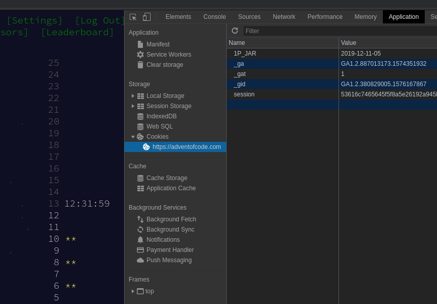

To get the session cookie you need to retrieve personal input, for example in Chrome:

* Hit Ctrl-Shift-I for developer tools.
* Copy the "session" cookie text from the Application tab, as shown below:

